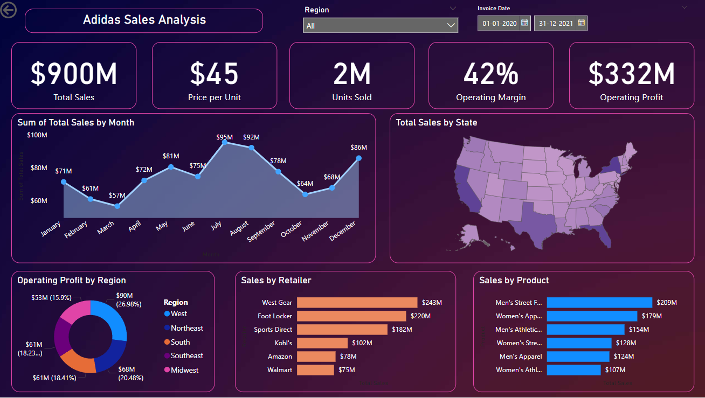

# 🎯 Adidas USA Sales Analysis Dashboard

## 📊 Overview
This project showcases an **interactive Power BI dashboard** analyzing Adidas store sales across the USA. It provides valuable insights into sales trends, performance metrics, and profitability, enabling data-driven decision-making.

---

## ✨ Key Features
- 💵 **Total Sales**: $900M revenue visualized.
- 📅 **Monthly Trends**: Line chart of sales by month.
- 🌎 **Regional Analysis**: Operating profit across USA regions.
- 🛒 **Top Retailers**: Sales breakdown by retailer.
- 👟 **Popular Products**: Insights into top-selling Adidas products.
- 🗺️ **State-Level Insights**: Map visualization of total sales by state.

---

## 🚀 Technologies Used
- **Power BI**: For creating the dashboard.
- **Processed Dataset**: Pre-cleaned and ready for analysis.

---

## 📌 Insights Derived
1. **Monthly Trends**:
   - Peak sales in **July ($95M)** and **August ($92M)**.
   - Low sales in **March ($57M)** and **April ($57M)**.

2. **Regional Profitability**:
   - West region contributed **27%** of total profit.
   - Southeast region showed consistent performance.

3. **Top Retailers**:
   - Highest revenue generated by **West Gear ($243M)**.

4. **Product Trends**:
   - Most sold category: **Men's Street Fashion ($209M)**.

---

## 🖼️ Dashboard Preview

---

## 📥 How to Use
1. Clone this repository.
2. Open the `.pbix` file in Power BI.
3. Explore the interactive visuals and gain insights! ✨

---

## 🛠️ Future Improvements
- Integrate **predictive analytics** to forecast future sales.
- Add **real-time data** for dynamic updates.
- Enhance interactivity with more filters.

---

## 📌 About Me
Hi! 👋 I'm a passionate data analyst exploring creative ways to present data. This dashboard demonstrates my skills in **EDA** and **visual storytelling**. Feel free to connect for feedback or collaboration! 🚀

---

## 🏆 Achievements
- Demonstrated expertise in Power BI and storytelling.
- Gained actionable insights for retail management.

---

## 🔗 Connect
- [LinkedIn](https://www.linkedin.com/in/abhilove-goyal/) 💼
- [GitHub](https://github.com/Abhilove-Goyal) 🖥️
